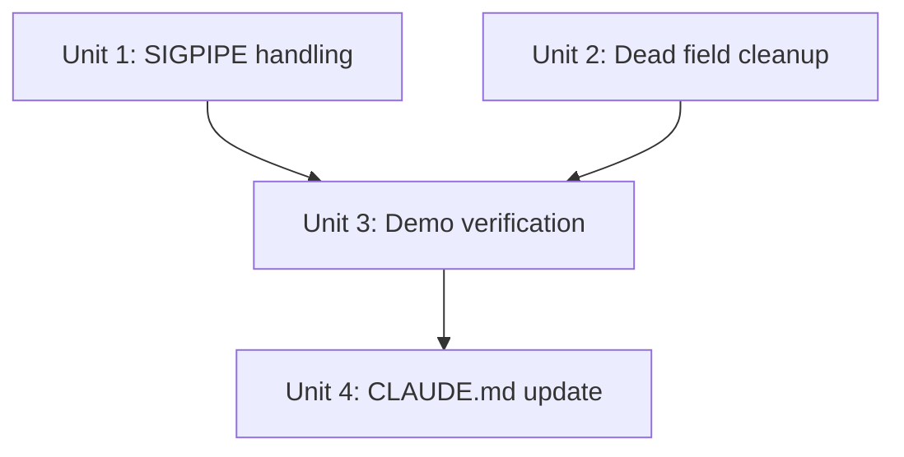

# fix: Consolidation pass — SIGPIPE, dead code, demo, docs

## Overview

The MVP TUI is functionally complete but feels like patchwork. This plan tightens the codebase by fixing a SIGPIPE handling bug that breaks the demo, removing dead fields that represent unkept architectural promises, choosing a SIGPIPE-proof demo pipeline, and updating CLAUDE.md to reflect reality.

## Problem Frame

After the animation-polish implementation session, three classes of issues emerged:

1. **Behavioral bug:** The runner treats SIGPIPE as failure. In Unix pipelines, when a downstream stage exits early (e.g., `head -20`), upstream stages receive SIGPIPE — this is normal, expected behavior. The runner's binary pass/fail from `cmd.Wait()` has no signal classification, so affected stages show red ✗ instead of green ✓.

2. **Dead code:** Five struct fields and one event type were defined speculatively but never wired up. They create false expectations about the codebase's capabilities and add cognitive load for contributors.

3. **Documentation drift:** CLAUDE.md contains multiple factual errors (wrong import paths, nonexistent dependency, incorrect pattern descriptions) and is missing six files added during the animation session.

## Requirements Trace

- R1. SIGPIPE on non-final stages must be treated as successful completion
- R2. Remove all unused struct fields and event types from the domain model
- R3. Demo pipeline must complete with all stages showing ✓ (no SIGPIPE trigger)
- R4. CLAUDE.md must accurately reflect the current codebase
- R5. All existing tests must continue to pass; new tests must cover SIGPIPE behavior

## Scope Boundaries

- No new features — this is purely tightening
- No changes to the adapter layer
- No changes to the animation, inspector, or statusbar logic
- No README (that's next plan)
- No CI/CD setup (that's next plan)

## Context & Research

### Relevant Code and Patterns

- **Runner error handling:** `internal/pipeline/runner.go` lines 122-138 — binary `err != nil` check after `cmd.Wait()`. No error classification exists.
- **Go SIGPIPE pattern:** `errors.As(err, &exitErr)` then check `exitErr.ProcessState.Sys().(syscall.WaitStatus).Signal() == syscall.SIGPIPE`. Exit code 141 = 128 + SIGPIPE(13).
- **Test patterns:** Table-driven tests in `unix_test.go`, helper functions `buildPipeline()`, `collectEvents()`, `stageID()` in `runner_test.go`.
- **countingWriter:** The actual interception pattern is `io.Pipe` + `countingWriter`, NOT `io.TeeReader` as CLAUDE.md claims.
- **Event system:** Runner uses blocking `tea.Cmd` channel reads via `waitForEvent()`, NOT `tea.Sub` as CLAUDE.md claims.

### CLAUDE.md Specific Errors (verified)

1. "TeeReader interception" → actually `countingWriter` wrapping `io.Pipe`
2. "UI subscribes via tea.Sub" → actually blocking `tea.Cmd` via `waitForEvent()`
3. "Runner emits StageStarted/Output/Done/Failed" → `EventStageOutput` is never emitted
4. Go version says "1.23+" → `go.mod` specifies `1.25.0`
5. Import paths say `github.com/charmbracelet/*` → actual paths are `charm.land/*`
6. Lists `bubbles/v2` as dependency → not in `go.mod`, never imported
7. Missing `gopkg.in/yaml.v3` from dependencies
8. Architecture section missing 7 files: ringbuffer.go, event.go, inspector.go, statusbar.go, helpers.go, theme.go, model.go

### Dead Fields Inventory (verified by grep)

| Field | Declared In | Written | Read | Verdict |
|-------|------------|---------|------|---------|
| `StageStats.BytesIn` | pipeline.go | Never | Never | Remove |
| `StageStats.LinesIn` | pipeline.go | Never | Never | Remove |
| `StageStats.Throughput` | pipeline.go | Never | Never | Remove |
| `Stage.DependsOn` | pipeline.go | Never | Never | Remove |
| `EventStageOutput` | event.go | Never | Never | Remove |

## Key Technical Decisions

- **SIGPIPE classification location:** Handle in the runner's Wait() goroutine, not globally. The runner is the only place where subprocess exit status is interpreted. This keeps the fix surgical and doesn't affect other error paths.

- **SIGPIPE = success only for non-final stages:** A SIGPIPE on the last stage would be unexpected and should remain an error. For all other stages, SIGPIPE means "downstream closed its stdin" which is normal pipe behavior.

- **Cross-platform guard:** SIGPIPE handling uses `syscall.WaitStatus` which is Unix-only. Gate behind a build tag or runtime check. On Windows, SIGPIPE doesn't occur in pipelines, so the check is simply skipped.

- **Demo pipeline choice:** Replace `seq 1 10000000 | grep 7 | sort -r | head -20 | wc -l` with a pipeline that doesn't trigger SIGPIPE. Options: (a) remove the `head` stage, (b) use a pipeline where all data flows through completely, (c) keep `head` but with SIGPIPE fix in place. Decision: **fix SIGPIPE first, then keep the current demo pipeline** — it's actually a good stress test. If SIGPIPE is handled correctly, the demo works perfectly and proves the tool handles real Unix pipe semantics.

- **Dead field removal strategy:** Remove fields, remove any associated atomic accessors, and remove the `EventStageOutput` constant. The `Event.Output` field stays because it's used for stderr on `EventStageFailed`.

## Open Questions

### Resolved During Planning

- **Q: Should we also handle non-zero exit codes from commands like `grep` (exit 1 = no matches)?** No. `grep` returning exit 1 is semantically different from SIGPIPE. It indicates the command completed but found nothing. Handling arbitrary exit codes is out of scope for this consolidation pass. The SIGPIPE fix is specifically for signal-based termination.

- **Q: Should `Event.Output` be renamed since `EventStageOutput` is being removed?** No. The field is documented as `// for EventStageOutput` in the comment, but it's actually used for stderr on failure events. Just update the comment.

### Deferred to Implementation

- **Q: Does the SIGPIPE check need a build tag file for Windows?** Depends on whether `syscall.WaitStatus` compiles on Windows. If not, a `_unix.go` / `_windows.go` split may be needed. Check during implementation.

## Implementation Units



- [ ] **Unit 1: Handle SIGPIPE as success for non-final stages**

  **Goal:** Make the runner treat SIGPIPE on non-final stages as successful completion instead of failure.

  **Requirements:** R1, R5

  **Dependencies:** None

  **Files:**
  - Modify: `internal/pipeline/runner.go` — add SIGPIPE classification in the Wait() goroutine
  - Test: `internal/pipeline/runner_test.go` — add SIGPIPE-specific test

  **Approach:**
  - In the Wait() goroutine (after `cmd.Wait()`), before the `if err != nil` check, inspect the error
  - Use `errors.As(err, &exitErr)` to extract `*exec.ExitError`
  - Check `exitErr.ProcessState.Sys().(syscall.WaitStatus).Signal() == syscall.SIGPIPE`
  - If SIGPIPE and this is not the final stage (`idx < len(cmds)-1`), set `err = nil` to treat as success
  - Add imports: `errors`, `os/exec`, `syscall`
  - Guard the `syscall.WaitStatus` type assertion appropriately for cross-platform safety

  **Patterns to follow:**
  - Existing error handling in `runner.go` lines 122-138
  - Go standard pattern: `var exitErr *exec.ExitError; if errors.As(err, &exitErr) { ... }`

  **Test scenarios:**
  - Happy path: Pipeline `echo hello | head -1 | wc -l` — all three stages should complete with StatusDone (head exits early, echo gets SIGPIPE, should still be Done)
  - Happy path: Pipeline with `sort | head` pattern — sort gets SIGPIPE when head exits, sort should be StatusDone
  - Edge case: SIGPIPE on the last stage should still be StatusFailed
  - Edge case: Genuine command failure (not SIGPIPE) on a non-final stage should still be StatusFailed
  - Integration: The demo pipeline `seq 1 10000000 | grep 7 | sort -r | head -20 | wc -l` should complete with all 5 stages StatusDone

  **Verification:**
  - All new SIGPIPE tests pass
  - All existing runner tests still pass
  - `make demo` shows all stages with ✓

- [ ] **Unit 2: Remove dead fields and unused event type**

  **Goal:** Clean up the domain model by removing fields and types that were never wired up.

  **Requirements:** R2, R5

  **Dependencies:** None (can run in parallel with Unit 1)

  **Files:**
  - Modify: `internal/pipeline/pipeline.go` — remove `BytesIn`, `LinesIn`, `Throughput` from StageStats; remove `DependsOn` from Stage
  - Modify: `internal/pipeline/event.go` — remove `EventStageOutput` constant; update `Event.Output` comment
  - Test: `internal/pipeline/runner_test.go` — verify existing tests still pass (no test changes expected since no test references these fields)

  **Approach:**
  - Remove `BytesIn int64`, `LinesIn int64`, `Throughput float64` from `StageStats`
  - Remove `DependsOn []string` from `Stage`
  - Remove `EventStageOutput` from the `EventType` iota block — note this will shift `EventStageDone`, `EventStageFailed`, `EventPipelineDone` values. Verify no code compares event types by integer value (all comparisons use named constants, so this should be safe)
  - Update the `Event.Output` field comment from "for EventStageOutput" to "stderr output for EventStageFailed"
  - Check if any adapter (unix or yaml) sets `DependsOn` — repo research confirms neither does
  - Check if any test references the removed fields — repo research confirms none do

  **Patterns to follow:**
  - Existing struct definitions in `pipeline.go`

  **Test scenarios:**
  - Happy path: Full test suite passes with no changes to test files (removed fields were never tested because they were never populated)
  - Edge case: Verify `EventStageDone`, `EventStageFailed`, `EventPipelineDone` still work correctly after iota shift (existing tests that check event types serve as regression)

  **Verification:**
  - `go build ./...` succeeds (no compile errors from removed fields)
  - `go test ./...` all pass
  - `grep -r "BytesIn\|LinesIn\|Throughput\|DependsOn\|EventStageOutput"` across `.go` files returns zero matches

- [ ] **Unit 3: Verify demo experience end-to-end**

  **Goal:** Confirm the demo pipeline works correctly after SIGPIPE fix and dead code removal.

  **Requirements:** R3, R5

  **Dependencies:** Unit 1, Unit 2

  **Files:**
  - Test: manual `make demo` execution
  - Possibly modify: `cmd/pipe/main.go` — only if demo pipeline needs adjustment

  **Approach:**
  - Build and run `make demo`
  - Verify all 5 stages complete with ✓
  - Verify animated connectors flow during execution
  - Verify status bar shows accurate progress
  - Verify Tab selection and inspector work
  - Verify linger period shows final state
  - If any issue found, diagnose and fix before proceeding

  **Test scenarios:**
  - Happy path: `make demo` runs, all 5 stages show ✓ done, animation visible during execution
  - Happy path: Tab cycles through stages, inspector shows output data
  - Happy path: Status bar shows "5/5 stages" at completion
  - Edge case: `q` quits cleanly at any point during execution

  **Verification:**
  - Visual confirmation of clean demo run
  - No red ✗ stages
  - No error messages

- [ ] **Unit 4: Update CLAUDE.md to reflect reality**

  **Goal:** Fix all factual errors and add missing files to the architecture section.

  **Requirements:** R4

  **Dependencies:** Unit 1, Unit 2 (so CLAUDE.md reflects the final state)

  **Files:**
  - Modify: `CLAUDE.md`

  **Approach:**
  - Fix "TeeReader interception" → "countingWriter interception: stdout piped through io.Pipe with countingWriter for byte/line monitoring and ring buffer capture"
  - Fix "UI subscribes via tea.Sub" → "UI reads events via blocking tea.Cmd on runner channel"
  - Fix "Runner emits StageStarted/Output/Done/Failed" → remove "/Output" — runner emits StageStarted/Done/Failed/PipelineDone
  - Update Go version: "Go 1.23+" → "Go 1.25+"
  - Fix import paths: `github.com/charmbracelet/bubbletea/v2` → `charm.land/bubbletea/v2`, same for lipgloss
  - Remove `github.com/charmbracelet/bubbles/v2` from dependencies
  - Add `gopkg.in/yaml.v3` to dependencies
  - Add missing files to architecture diagram:
    ```
    internal/pipeline/event.go      → Event types (StageStarted/Done/Failed/PipelineDone)
    internal/pipeline/ringbuffer.go → Thread-safe circular buffer for output capture
    internal/ui/model.go            → Main Bubbletea model (tick loop, event handling)
    internal/ui/inspector.go        → Data preview panel (Tab to select stage)
    internal/ui/statusbar.go        → Progress counter + key hints
    internal/ui/helpers.go          → Formatting utilities (bytes, lines, duration)
    internal/ui/theme.go            → Catppuccin Mocha color palette
    ```

  **Test expectation:** none — documentation-only change

  **Verification:**
  - Every import path in CLAUDE.md matches what appears in `go.mod` and source files
  - Every file listed in architecture section exists on disk
  - Every pattern description matches the actual implementation

## System-Wide Impact

- **Interaction graph:** The SIGPIPE fix only affects the runner's Wait() goroutine error path. No changes to event types consumed by the UI (EventStageDone is already handled). The UI will simply see more stages completing as Done instead of Failed.
- **Error propagation:** SIGPIPE errors are now silently converted to success for non-final stages. Genuine command failures (non-zero exit without SIGPIPE) are unaffected.
- **State lifecycle risks:** None. The iota shift from removing `EventStageOutput` is safe because all event type comparisons use named constants, never integer literals.
- **API surface parity:** No external API exists. CLI behavior is unchanged.
- **Unchanged invariants:** The adapter interface, TUI rendering logic, ring buffer, and animation system are not touched by this plan.

## Risks & Dependencies

| Risk | Mitigation |
|------|------------|
| `syscall.WaitStatus` may not compile on Windows | Gate behind runtime OS check or build tags. Verify during implementation. |
| Removing `EventStageOutput` shifts iota values | All comparisons use named constants. Existing tests serve as regression. |
| SIGPIPE fix may mask genuine errors | Only SIGPIPE signal is treated as success, and only on non-final stages. All other errors remain failures. |
| Demo pipeline timing may vary across machines | The 10M seq produces enough work for 2-3 seconds on most hardware. The linger ensures final state is visible regardless. |

## Sources & References

- Go `exec.ExitError` pattern: [golang/go#35874](https://github.com/golang/go/issues/35874)
- SIGPIPE exit code 141 = 128 + 13: standard Unix convention
- Repo research: all dead field analysis verified by grep across `.go` files
- Feedback review: `~/Open_Source_Lab/01_Projects/pipe-dev/feedback/2026-04-09_mvp_review.md`
